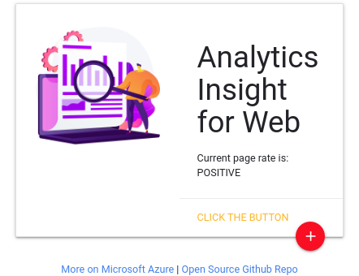

# Chrome Extension Tool
## Introduction

Uses Microsoft Azure text analytics AI services API for insights on given text. Chrome extension feature allows users to see the texts cognitive sentiment and scores it. User can click on the Chrome extension icon to see results.

## Getting Started 
1. Open the file "contentscript.js" and insert your Azure subscription key into `const apiKey = "";`
2. [Follow these instructions](https://developer.chrome.com/extensions/getstarted)
    1. Go to Google Chrome extensions page: [chrome://extensions/](chrome://extensions/)
    2. Click 'Load unpacked'. Navigate to this repo to use
    3. You're all set!

## Docs
### Microsoft Azure
- [More on Microsoft Azure](https://azure.microsoft.com/en-us/services/cognitive-services/text-analytics/)

### Chrome Extensions
- [More on Chrome Extensions](https://developer.chrome.com/extensions/)

A experimentation project on chrome extention:
- https://developer.chrome.com/extensions/getstarted
- https://developer.chrome.com/extensions/overview
- https://developer.chrome.com/extensions/devguide

### Scraping
For scraping what's visible on the displayed page: 
- https://developer.chrome.com/extensions/content_scripts

### Intercepting Http Requests
For intercepting Http requests: 
- https://stackoverflow.com/questions/8939467/chrome-extension-to-read-http-response/48134114#48134114
